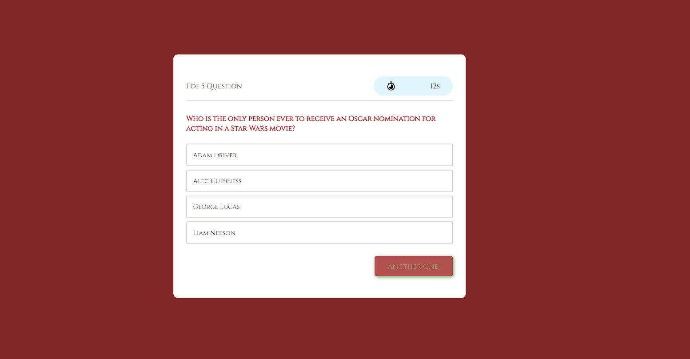

Richard Murillo's README

 # Are You Smarter Than

## Table of Contents

 * [Description](#description)

 * [Installation](#installation)

 * [Usage-Information](#usage-information)

 * [Contribution-Guidelines](#contribution-guidelines)

 * [Test-Instructions](#test-instructions)

 * [License](#license)

 * [Questions](#questions)

## Description

On this Module I created a mini quiz using HTML, CSS and Javascript The theme is Hollywood trivia and  I Hhope you enjoy it.

## Installation

1.clone the repo:https://github.com/RichMur84/Are-You-Smarter-Than-.git 2.Run in VS Code

## Usage Information

Pressing the Begin button will give you five questions and a timer of 15 seconds good luck!

## Contribution Guidelines

n/a

## Test Instructions

n/a

## License

NOTICE: This application is covered under the MIT

## Questions

Have additional questions? Click the links below to reach me through my GitHub account or Email address.

[Link to Github](https://github.com/https://github.com/RichMur84)

<a href="mailto:grizzlylbc1@gmail.com">grizzlylbc1@gmail.com</a>

